# YouTube Music for Steam

Bring YouTube Music into SteamOS. This Decky Loader plugin turns Steam's Quick Access panel into a controller-friendly music player and Cast receiver, with an integrated library, queue, search, lyrics, and a polished fullscreen listening view.

Built for **Steam Deck** and **Steam Machine** on SteamOS wherever Decky Loader is available. The Deck is the tested platform; Decky Loader has not yet published official Steam Machine support, so Machine users are invited to try it and share compatibility reports.

> This is an unofficial community project and is not affiliated with YouTube, Google, or Valve.

## Screenshots

| Player | Casting from your phone |
| --- | --- |
| 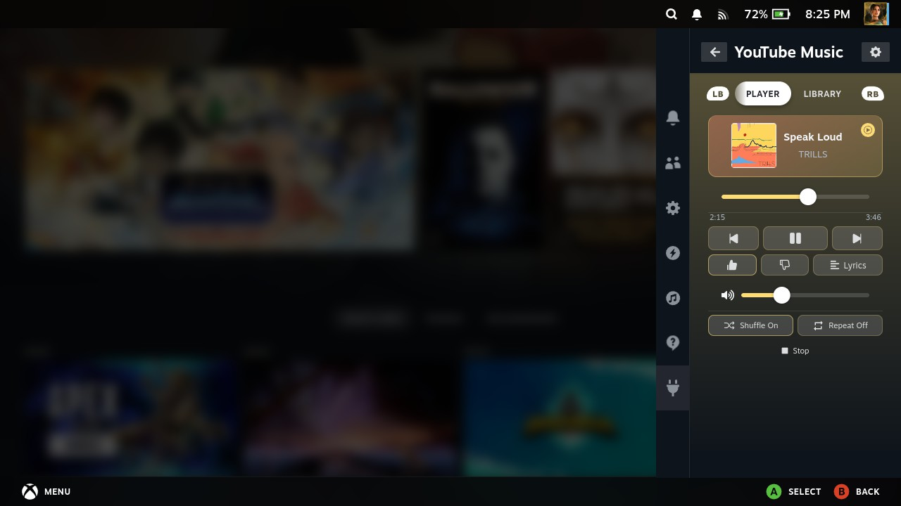 | 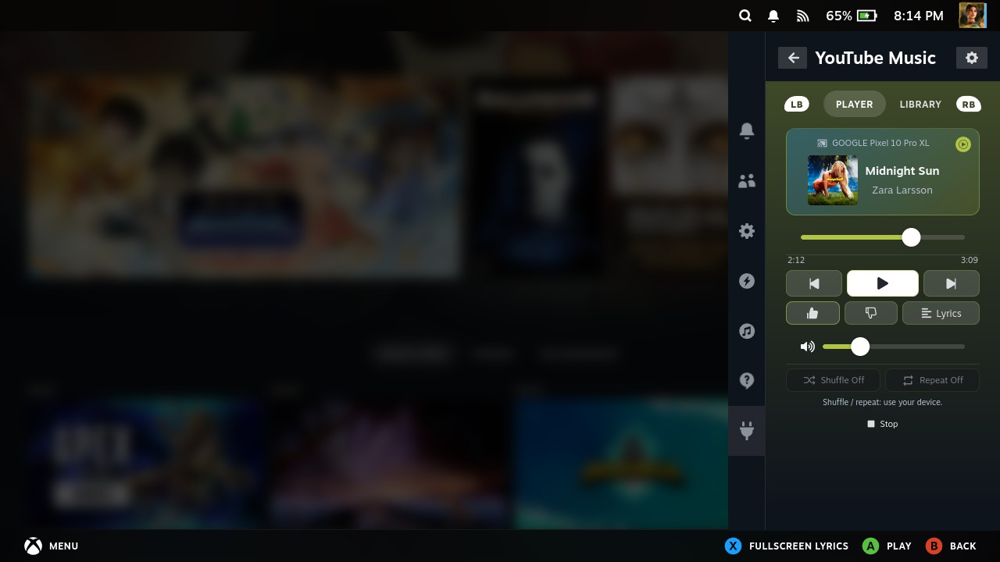 |

| Library | Queue |
| --- | --- |
| 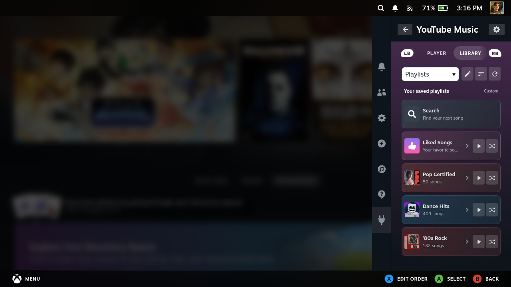 | 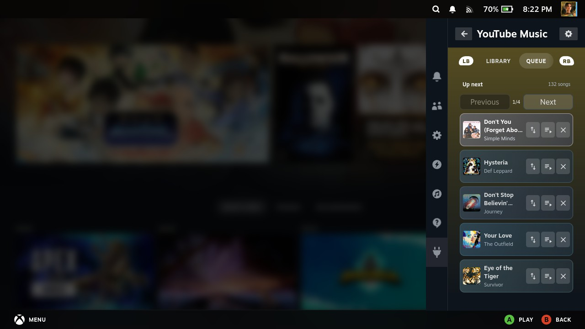 |

| Library categories | Search albums | Artist albums |
| --- | --- | --- |
| 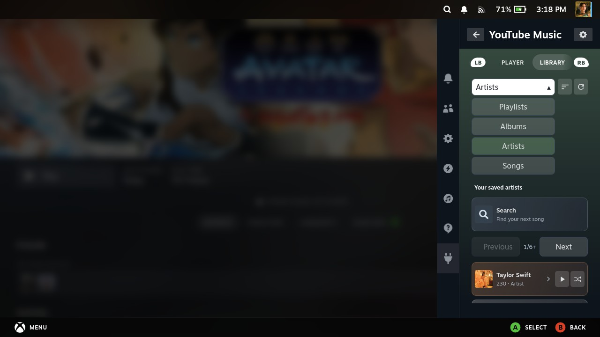 | 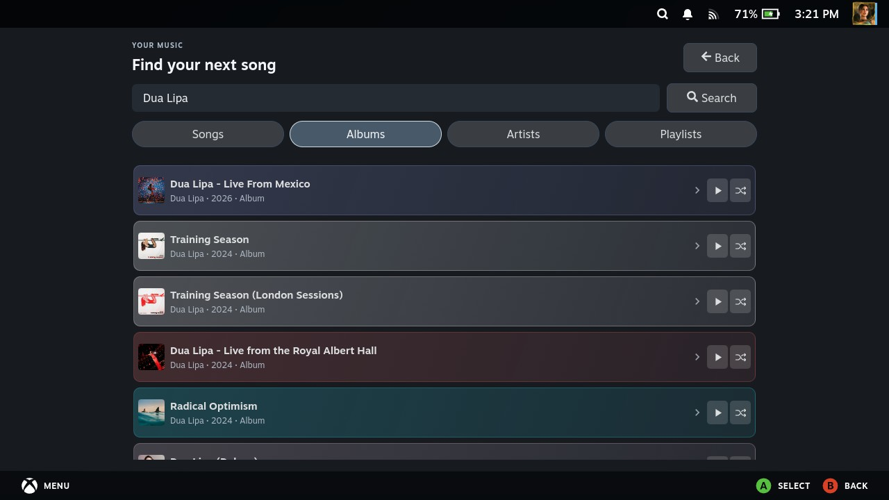 | 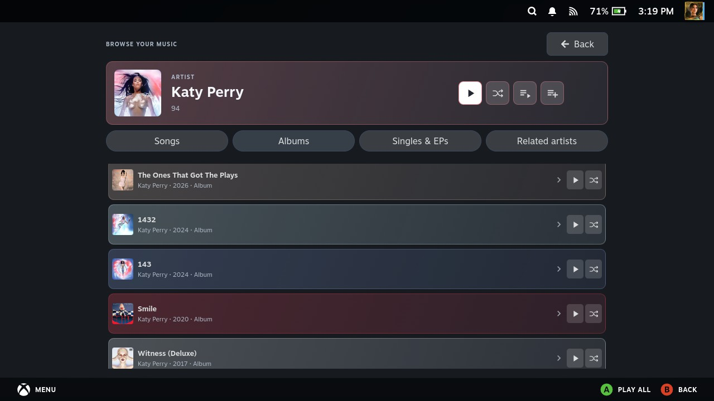 |

| Open playlist | Lyrics in Quick Access |
| --- | --- |
| 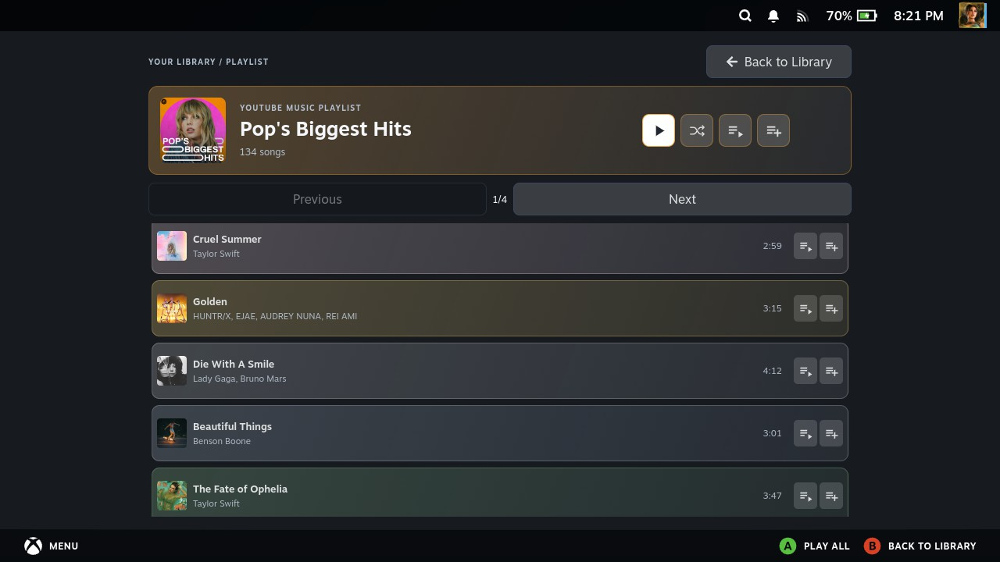 | 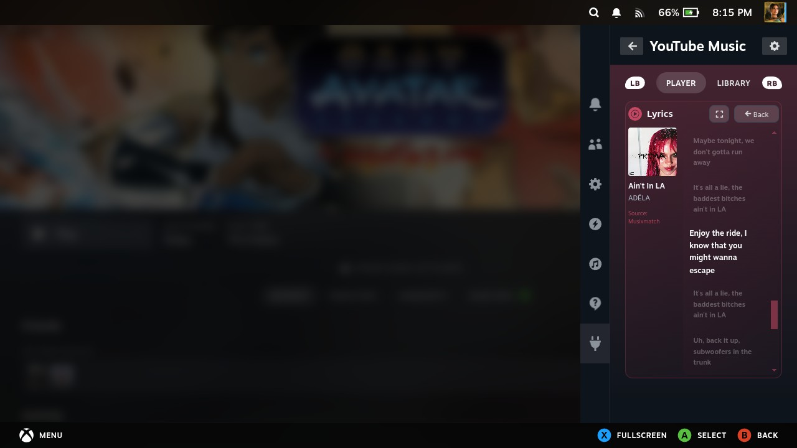 |

| Fullscreen lyrics | Translated lyrics |
| --- | --- |
| 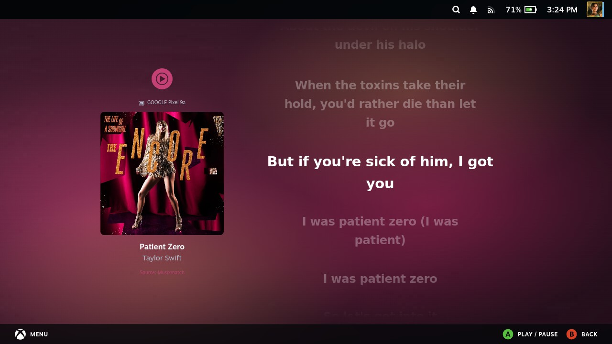 | 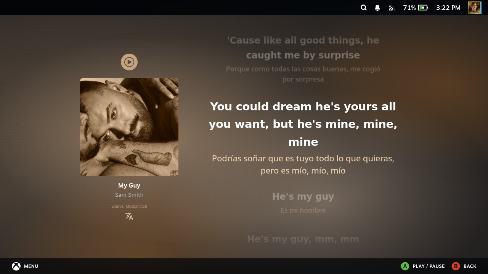 |

| Cast lyrics fullscreen | Language settings | Cookie import |
| --- | --- | --- |
| 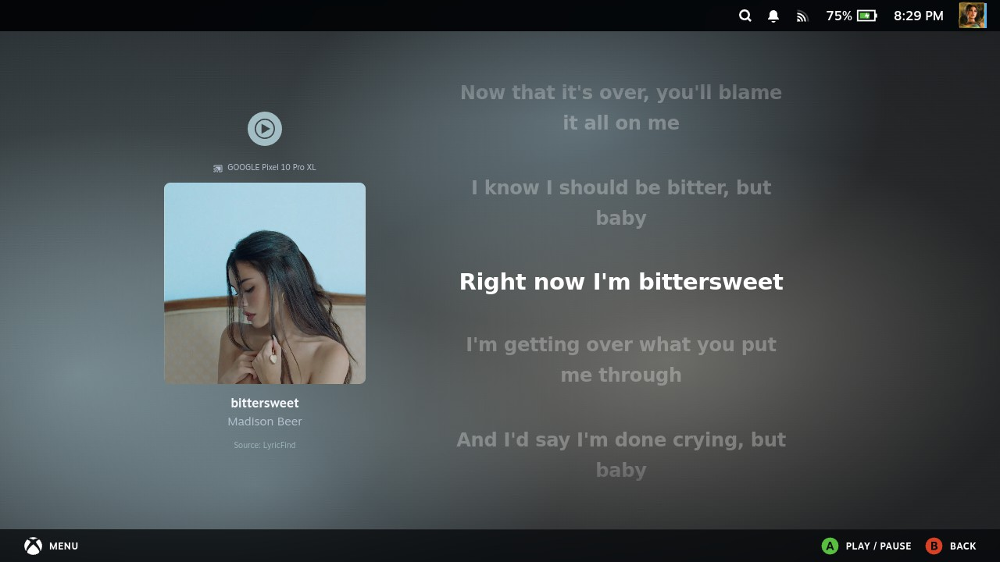 | 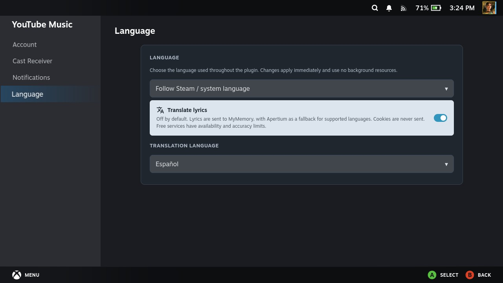 | 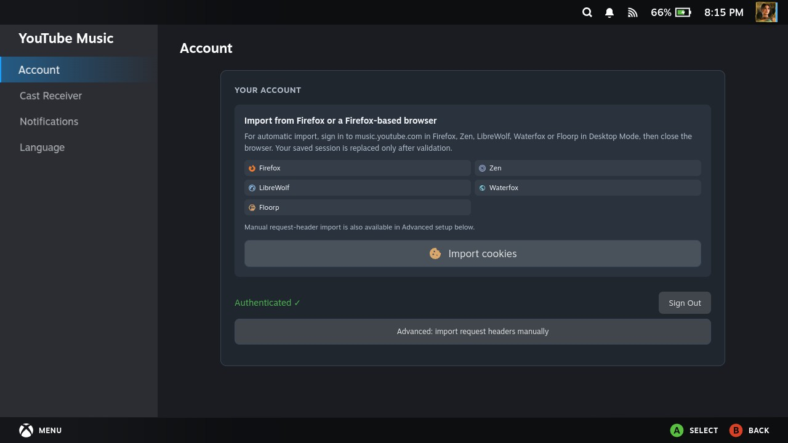 |

## What it can do

- **Listen from Quick Access:** search and play tracks, browse your YouTube Music library, and control playback with the Steam Deck controls.
- **Start big playlists sooner:** playback can begin from the first playable batch while the rest of the playlist loads in the background. The queue fills as loading continues.
- **Manage music your way:** open playlists to browse and queue individual songs, or play, shuffle, play next, and add the whole playlist. Reorder the queue and set your library to A–Z, Z–A, or a custom order.
- **Explore the catalogue:** filter Library and Search by playlists, albums, artists or songs. Open an album's track list, or explore an artist's songs, albums, singles and related artists. New collection lists are paginated, with L2/R2 navigation that returns focus to the first item.
- **Cast to your Steam system:** receive YouTube and YouTube Music Cast sessions from a phone or another device on your trusted network. Playback state, track changes, and supported controls stay in sync with the sender.
- **Import your account from Firefox-family browsers:** in Desktop Mode, sign in to YouTube Music in Firefox, Zen, LibreWolf, Waterfox, or Floorp, then use **Import cookies**. Manual request-header import is available for other browsers. The plugin saves the session locally; it never asks for your Google password.
- **Read along:** use compact or fullscreen lyrics. Fullscreen follows timed lyrics when available, adds a slow cover-colored backdrop, and requests temporary screen-awake protection while lyrics are open. Optional lyric translation uses a separate language selector and preserves the original lines.
- **Keep the experience cohesive:** artwork colors inform the player, library, and lyrics; track and Cast notifications use Steam's native notification system. Manually selected local songs stay quiet; automatic track changes can notify you.
- **Stop cleanly:** Stop ends the Cast session and clears the active queue.

## Install

Download the latest installable ZIP from [Releases](https://github.com/josejuanlr98/youtube-music-for-steam/releases/latest). In Gaming Mode, open **Decky → Developer Options → Install from ZIP**, select the file, then restart Decky if needed. The `-source` ZIP is for developers and is not the normal installer.

Cast works without signing into the plugin. To use account features such as Library, Search, likes, and lyrics, open **Settings → Account** and import a YouTube Music session from a supported Firefox-family browser. The browser must be installed on the SteamOS device, opened in Desktop Mode, and signed into YouTube Music first.

## Cast setup

Open **Settings → Cast Receiver** and trust the network you use. Your phone and Steam system must be on the same local network. Client isolation, multicast filtering, and some mesh Wi-Fi configurations can prevent device discovery.

The sender's queue is the initial source during Cast. The plugin keeps the queue order as tracks advance and lets you edit the receiver queue; some sender apps may continue showing their original queue because Cast does not offer a portable queue-write operation.

## Fullscreen lyrics

Open Lyrics and press **X** for fullscreen; press **B** to return. When timed lyrics are available, the current line follows playback and seeking. Otherwise, fullscreen uses a gentle reading scroll. For untimed lyrics, manual scrolling pauses reading for five seconds, then continues from your position. At the end, it waits five seconds and repeats. Timed lyrics return to the current sung line five seconds after manual input. Artist and Cast details share the light cover color used by translations. The view asks Steam for temporary wake protection and releases it on exit; availability depends on Steam/CEF.

Lyrics are loaded on demand and cached for a small number of recent tracks. LRCLIB may provide a timing fallback when its song and artist match. Lyrics availability and timing depend on the providers and version of the recording.

Lyric translation is off by default. Enable it in **Settings → Language** and select a target language. Lyric text, without cookies or account data, is sent to MyMemory on demand, with Apertium as a free fallback for the language pairs it supports. No API key is required. Provider quotas and availability are external to this plugin; when it is exhausted or unavailable, the original lyrics remain visible and the reader explains the problem. Successful lines are cached locally across restarts, repeated verses reuse the same translation, and partial results survive failures. Use Retry translation to request only missing lines. The original and translated lines share one highlight animation.

## Privacy and account sessions

The imported browser session is stored locally on the Steam system so the plugin can access your YouTube Music library. It contains cookies, so treat the Steam system and its files as private. Never upload your exported session or headers to GitHub. Signing in is optional for Cast-only use.

## Build and test

Requirements: Node.js, pnpm, Python, and PowerShell.

```powershell
pnpm install
pnpm run build
pnpm run build:backend
pnpm run typecheck:backend
pnpm test
pnpm exec vitest run
pnpm run test:python
```

Run `pnpm run package` to create the Decky install ZIP. The package includes the compiled frontend and backend, Python dependencies, and Linux runtime binaries.

## Project and attribution

Maintained by [josejuanlr98](https://github.com/josejuanlr98). The current repository has no co-maintainers. GitHub repository access has been updated accordingly.

This project incorporates and builds on licensed upstream work. The original [Decky YouTube Music Player](https://github.com/artistro08/decky-youtube-music-player) and [YouTube Cast Receiver](https://github.com/artistro08/youtube-cast-receiver) remain listed for source and license attribution; this does not describe a current collaboration. Other key dependencies include [yt-cast-receiver](https://www.npmjs.com/package/yt-cast-receiver), [ytmusicapi](https://github.com/sigma67/ytmusicapi), and [yt-dlp](https://github.com/yt-dlp/yt-dlp). Their respective licenses apply.

This project is released under BSD-3-Clause. See [LICENSE](LICENSE).

Library and Search use explicit Songs, Albums, Artists and Playlists filters. New artist windows open in Songs, with separate Albums, Singles & EPs and Related artists filters. New collection windows focus Play; going Back restores the parent filter, page, scroll position and selected item. Album and artist rows offer Play and Shuffle; opened collections offer Play, Shuffle, Play next and Add all. Artist pictures stay square and retain their original framing.

Library categories display a native first-page preview, then load more entries in the background. Refresh also publishes a fresh preview first, preserving usable rows while the full request completes. Previous/Next buttons navigate pages of 40 and retain focus on the matching upper control; L2/R2 focus the first result. Next fetches additional results when needed. Search opens with its input focused and receives Library's category before the first search; afterwards its query, category and results are preserved. Cached catalogue reads and playable album pointers avoid unnecessary requests.

Translation requests for different songs or target languages run independently. Same-song requests are shared, language detection is initialized safely, and repeated source-language detection is cached. Google Cloud Translation requires authentication; its unauthenticated web endpoint returned HTTP 429 during verification, so it is not used as a dependable no-key provider.

AI tools assisted development and testing. Feedback is especially welcome: report the steps to reproduce a problem, your SteamOS/Decky versions, and whether you were playing directly or casting. Use it while gaming or enjoy fullscreen lyrics while games download, and tell us how it works for you.
